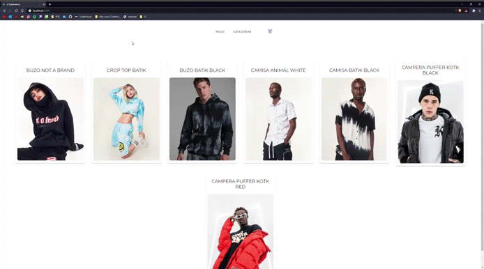

# e-Commerce con ReactJS

Entrega intermedia del proyecto final de React para CoderHouse. 

Lenguajes utilizados:

<li>ReactJS</li>
<li>JavaScript</li>
<li>JSX</li>
<li>HTML5</li>
<li>CSS3</li>

Dependencias utilizadas:

<li>@Material-UI /core /icons /lab</li>
<li>react-router-dom</li>

Version de React 17.0.2

# Deploy the baby

<code>npm start</code>

# Test
<code>npm test</code>
